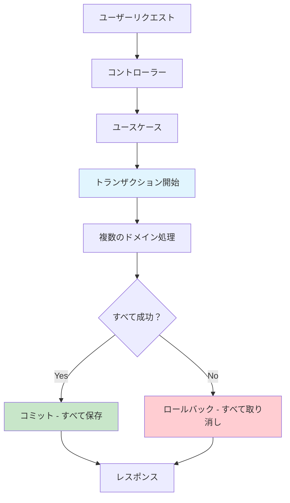
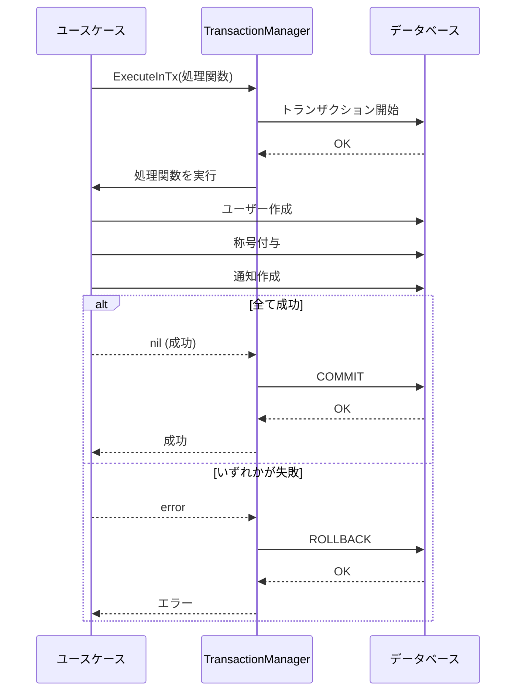

# トランザクション管理システム

## 📖 概要

このファイルは「**データベースの整合性を保つための安全装置**」です。

複数のデータベース操作をひとつの**原子的な処理**として扱い、すべてが成功するか、すべてが失敗するかのどちらかにします。

## 🔍 トランザクションとは？

### 日常の例で理解する

**銀行の振込を想像してください**：

1. あなたの口座から1万円を引く
2. 相手の口座に1万円を足す

もし2番目の処理で**エラー**が起きたら？
- ❌ **悪い状況**: あなたの口座だけ1万円減って、相手の口座は増えない
- ✅ **良い状況**: 全体をキャンセルして、最初の状態に戻す

**トランザクション = この「全体をキャンセルする仕組み」**

## 🏗️ アーキテクチャでの役割



## 📋 実装内容の解説

### 1. Manager インターフェース

```go
type Manager interface {
    ExecuteInTx(ctx context.Context, fn func(context.Context) error) error
}
```

**意味**: 「トランザクション内で何かを実行する機能」を定義

### 2. ExecuteInTx メソッド

```go
func (m *manager) ExecuteInTx(ctx context.Context, fn func(context.Context) error) error {
    return m.db.WithContext(ctx).Transaction(func(tx *gorm.DB) error {
        txCtx := context.WithValue(ctx, "tx", tx)
        return fn(txCtx)
    })
}
```

**動作手順**:
1. データベースのトランザクションを開始
2. 渡された関数を実行
3. 成功 → コミット（保存）
4. 失敗 → ロールバック（取り消し）

### 3. GetDB ヘルパー関数

```go
func GetDB(ctx context.Context, defaultDB *gorm.DB) *gorm.DB {
    if tx, ok := ctx.Value("tx").(*gorm.DB); ok {
        return tx // トランザクション中
    }
    return defaultDB // 通常のDB接続
}
```

**役割**: 「今トランザクション中か？」を判定して適切なDB接続を返す

## 🎯 使用例

### Ghoona Camp での実際の使用例

**ユーザー登録 + 初期称号付与**:

```go
// ユーザー登録ユースケース
func (u *UserUseCase) RegisterUser(ctx context.Context, req *RegisterUserRequest) error {
    return u.txManager.ExecuteInTx(ctx, func(txCtx context.Context) error {
        // 1. ユーザーを作成
        user := NewUser(req.Name, req.Email)
        if err := u.userRepo.Save(txCtx, user); err != nil {
            return err // ここで失敗したら全体がロールバック
        }
        
        // 2. 初期称号を付与
        title := NewTitle(user.ID, "新参者")
        if err := u.titleRepo.Save(txCtx, title); err != nil {
            return err // ここで失敗してもユーザー作成も取り消される
        }
        
        // 3. 歓迎通知を送信
        notification := NewWelcomeNotification(user.ID)
        if err := u.notificationRepo.Save(txCtx, notification); err != nil {
            return err // ここで失敗したら全部取り消し
        }
        
        return nil // 全て成功 → コミット
    })
}
```

## 🔄 動作フロー図



## 🎯 なぜ重要なのか？

### データ整合性の保証

**❌ トランザクションなしの場合**:
```
ユーザー作成: ✅ 成功
称号付与: ❌ 失敗 (DB接続エラー)
通知作成: ❌ 実行されない

結果: ユーザーだけ作られて、称号も通知もない不整合状態
```

**✅ トランザクションありの場合**:
```
ユーザー作成: ✅ 成功
称号付与: ❌ 失敗 (DB接続エラー)
→ 全体がロールバック

結果: 何も変更されず、一貫性が保たれる
```

## 🚀 使用予定（後続タスク）

| タスクID | 使用場面 | 処理内容 |
|---------|----------|----------|
| BE-03-user-01 | ユーザー登録 | ユーザー作成 + 初期設定 |
| BE-03-attendance-01 | 出席記録 | 出席ログ + 統計更新 |
| BE-03-goal-01 | 目標作成 | 目標作成 + 進捗初期化 |
| BE-03-event-01 | イベント参加 | 参加記録 + 通知送信 |
| BE-03-title-01 | 称号獲得 | 称号付与 + 通知作成 |

## 💡 初学者向けのポイント

### DDD文脈での位置づけ

- **ドメイン層**: ビジネスルールを定義（「何をするか」）
- **アプリケーション層**: ユースケースを実装（「どう組み合わせるか」）
- **トランザクション**: 複数のドメイン処理を安全に実行する仕組み

### Goでの実装特徴

- **context.Context**: リクエスト情報とトランザクション情報を運ぶ
- **interface**: テスト時にモックに差し替え可能
- **GORM**: Go言語のORM、トランザクション機能を提供

## 🔧 実装のコツ

1. **ユースケース層でのみ使用**: コントローラーやドメイン層では直接使わない
2. **エラーハンドリング**: エラーが起きたら必ずreturnしてロールバックさせる
3. **ネストしない**: トランザクション内でさらにトランザクションを開始しない

---

**このファイルは BE-02-arch-01 で作成された基盤で、BE-03-* 以降の全タスクで活用されます。**