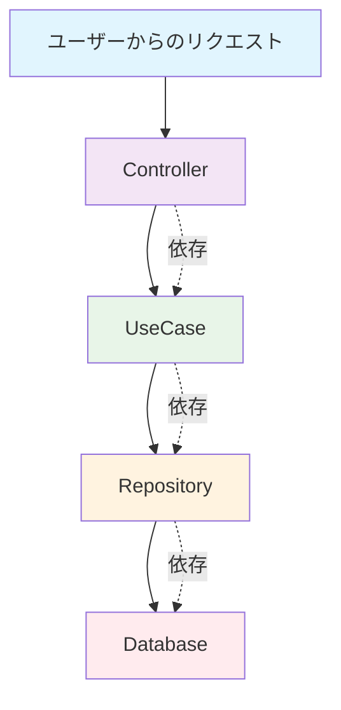
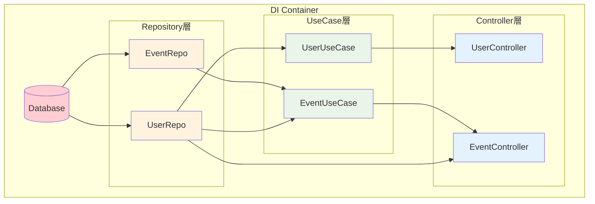
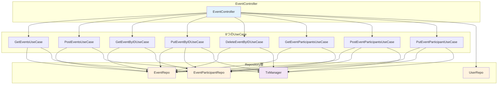

# DI Container（依存性注入コンテナ）完全ガイド

## 🏠 日常例：家を建てる工程で理解する

### 従来の方法（DIなし）
家を建てるたびに、毎回すべてを一から準備する非効率な方法：

```
家を建てる作業員の1日：
1. 朝：基礎工事のセメントを練る
2. 昼：電気工事の配線を用意する  
3. 夕方：屋根工事の瓦を準備する
4. 夜：やっと家の組み立て開始...
```

**問題点：**
- 毎回同じ準備作業を繰り返す
- 材料の調達方法を変えたら、全工程に影響
- 品質テストが困難（材料がバラバラ）

### DI Container方式
建設会社（Container）が事前にすべての材料と職人を準備：

```
建設会社の準備：
├── 基礎工事部門（Foundation）
├── 電気工事部門（Electrical）
├── 屋根工事部門（Roofing）
└── 総合管理部門（ProjectManager）

家を建てる時：
1. 「家を1軒お願いします」
2. 建設会社が準備済みのチームを派遣
3. 即座に建設開始！
```

## 🎯 技術概念への変換

### アプリケーション開発での問題



**従来の問題（new地獄）：**
```go
// ❌ 毎回この長い初期化が必要
func main() {
    db := gorm.Open(postgres.Open(dsn), &gorm.Config{})
    
    userRepo := repository.NewUserRepository(db)
    eventRepo := repository.NewEventRepository(db)
    txManager := transaction.NewManager(db)
    
    userUseCase := usecase.NewUserUseCase(userRepo, txManager)
    eventUseCase := usecase.NewEventUseCase(eventRepo, userRepo, txManager)
    
    userController := controller.NewUserController(userUseCase)
    eventController := controller.NewEventController(eventUseCase, userRepo)
    
    // さらに10個のコンポーネントが...
}
```

## 🏭 DI Containerの仕組み

### Container構造体（工場の設計図）

```go
type Container struct {
    // === 基盤設備 ===
    DB     *gorm.DB           // データベース接続
    Config *config.Config     // 設定情報
    
    // === 材料倉庫（Repository層） ===
    UserRepo  repository.UserRepository
    EventRepo repository.EventRepository
    
    // === 製造部門（UseCase層） ===
    UserUseCase  userUsecase.UserUseCase
    EventUseCase eventUsecase.EventUseCase
    
    // === 配送部門（Controller層） ===
    UserController  *controller.UserController
    EventController *controller.EventController
}
```

### 依存関係の流れ



## 🔧 実装パターン

### 1. Container初期化の順序

```go
func NewContainer(db *gorm.DB, cfg *config.Config) *Container {
    c := &Container{DB: db, Config: cfg}
    
    // 📚 Phase 1: 基盤設定
    c.TxManager = transaction.NewManager(db)
    
    // 📦 Phase 2: Repository層（材料倉庫）
    c.initRepositories()
    
    // ⚙️  Phase 3: UseCase層（製造部門）  
    c.initUseCases()
    
    // 🚚 Phase 4: Controller層（配送部門）
    c.initControllers()
    
    return c
}
```

### 2. 段階的初期化メソッド

```go
// 📦 Repository初期化（依存なし）
func (c *Container) initRepositories() {
    c.UserRepo = gormRepo.NewUserRepository(c.DB)
    c.EventRepo = gormRepo.NewEventRepository(c.DB)
    c.EventParticipantRepo = gormRepo.NewEventParticipantRepository(c.DB)
}

// ⚙️ UseCase初期化（Repository依存）
func (c *Container) initUseCases() {
    // シンプルなUseCase
    c.GetEventsUseCase = eventUsecase.NewGetEventsUseCase(
        c.EventRepo,
        c.EventParticipantRepo,
    )
    
    // 複雑なUseCase（複数依存）
    c.PostEventsUseCase = eventUsecase.NewPostEventsUseCase(
        c.EventRepo,
        c.TxManager,
    )
}

// 🚚 Controller初期化（UseCase依存）
func (c *Container) initControllers() {
    c.EventController = controller.NewEventController(
        c.GetEventsUseCase,
        c.PostEventsUseCase,
        // ... 残り6つのUseCase
        c.UserRepo, // 認証用
    )
}
```

## 📊 具体的な依存関係マップ

### EventController の依存関係



## 🎯 使用方法（実用編）

### 1. メイン関数での使用

```go
func main() {
    // データベース接続
    db := database.Connect()
    
    // 設定読み込み
    cfg := config.Load()
    
    // ✨ DI Container初期化（一度だけ）
    container := di.NewContainer(db, cfg)
    
    // Ginルーター設定
    router := gin.Default()
    
    // ✨ 事前準備されたControllerを使用
    eventRoutes := router.Group("/events")
    {
        eventRoutes.GET("", container.EventController.GetEvents)
        eventRoutes.POST("", container.EventController.PostEvents)
        eventRoutes.GET("/:eventId", container.EventController.GetEventByID)
        eventRoutes.PUT("/:eventId", container.EventController.PutEventByID)
        eventRoutes.DELETE("/:eventId", container.EventController.DeleteEventByID)
        // ...
    }
    
    router.Run(":8080")
}
```

### 2. テスト環境での使用

```go
func TestEventAPI(t *testing.T) {
    // テスト用データベース
    testDB := database.ConnectTestDB()
    testConfig := config.LoadTest()
    
    // ✨ テスト用Container
    container := di.NewContainer(testDB, testConfig)
    
    // テスト実行
    w := httptest.NewRecorder()
    req := httptest.NewRequest("GET", "/events", nil)
    
    // ✨ 準備されたControllerでテスト
    container.EventController.GetEvents(gin.CreateTestContext(w, req))
    
    assert.Equal(t, 200, w.Code)
}
```

## 🔍 DI Containerの利点

### 1. **コードの簡潔性**

```go
// ❌ 従来：20行の初期化コード
func NewEventHandler() *EventHandler {
    db := connectDB()
    userRepo := repository.NewUserRepository(db)
    eventRepo := repository.NewEventRepository(db)
    // ... 長い初期化
}

// ✅ DI Container：1行で完了
container := di.NewContainer(db, config)
eventController := container.EventController
```

### 2. **テスタビリティ**

```go
// モック用Container簡単作成
func NewTestContainer() *di.Container {
    mockDB := testDB.Connect()
    testConfig := config.NewTest()
    return di.NewContainer(mockDB, testConfig)
}
```

### 3. **設定の一元管理**

```go
// 設定変更は1箇所だけ
func (c *Container) initEventUseCases() {
    // ここを変更するだけで全体に反映
    c.PostEventsUseCase = eventUsecase.NewPostEventsUseCase(
        c.EventRepo,
        c.TxManager,
        c.DiscordService, // ← 新機能追加
    )
}
```

## 📝 実装チェックリスト

### Container構造体
- [ ] 依存関係の順序が正しい（Repository → UseCase → Controller）
- [ ] インターフェースを使用（テスト可能性）
- [ ] 適切なグループ分け（コメントで分類）

### 初期化メソッド
- [ ] Phase分けされた初期化順序
- [ ] 各Phaseごとのメソッド分割
- [ ] エラーハンドリング（必要に応じて）

### 使用方法
- [ ] main.goでの一度だけ初期化
- [ ] テスト用の別Container準備
- [ ] 環境別設定への対応

## 🚀 次のステップ

1. **新しいドメイン追加時**：
   ```go
   // 1. Repository追加
   GoalRepo repository.GoalRepository
   
   // 2. UseCase追加
   GoalUseCase usecase.GoalUseCase
   
   // 3. Controller追加
   GoalController *controller.GoalController
   
   // 4. 初期化メソッド追加
   c.initGoalComponents()
   ```

2. **外部サービス統合時**：
   ```go
   // Container に追加
   DiscordService *discord.Service
   EmailService   *email.Service
   
   // UseCase で使用
   c.NotificationUseCase = usecase.NewNotificationUseCase(
       c.NotificationRepo,
       c.DiscordService,
       c.EmailService,
   )
   ```

---

**まとめ**: DI Containerは「アプリケーション全体の部品工場」として、依存関係を整理し、コードを簡潔で保守しやすくします。一度理解すれば、大規模アプリケーション開発が格段に楽になります！