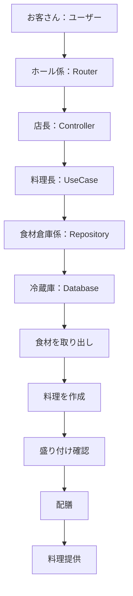
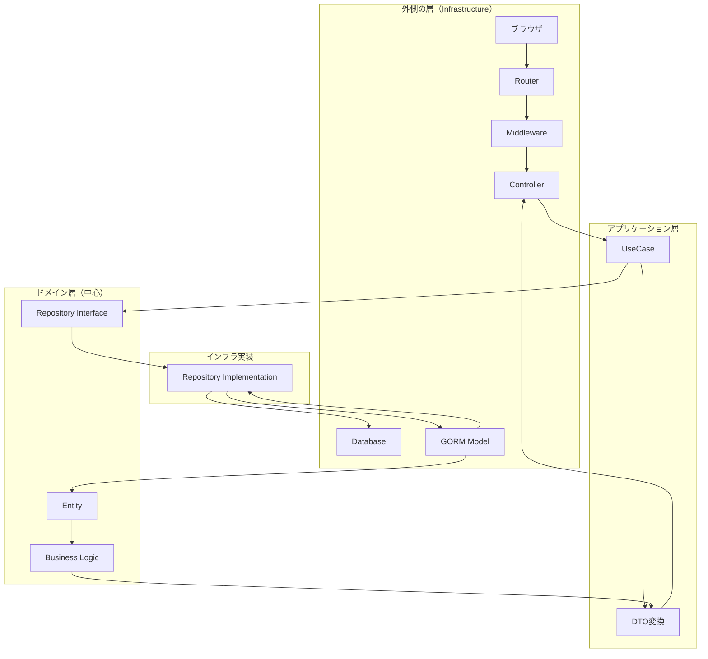
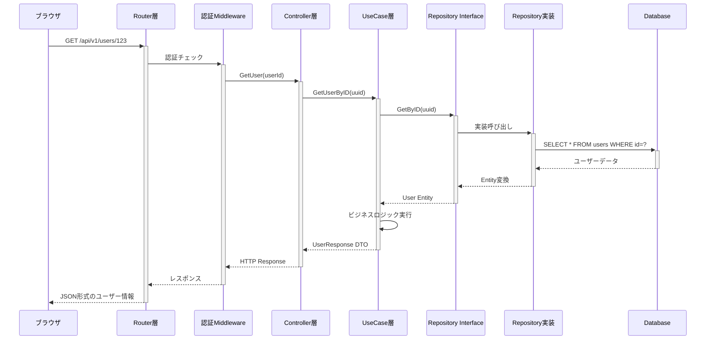
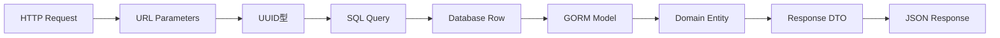
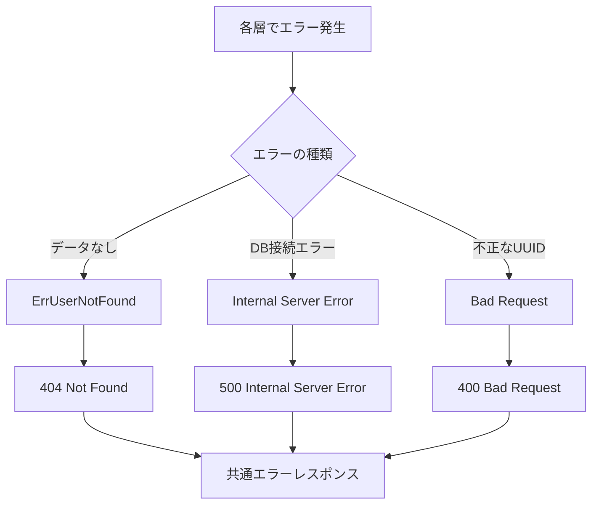

# オニオンアーキテクチャの理解：GetUser機能の処理フロー

## 概要

ユーザーがメンバーページをクリックしてから、システムがどのようにユーザー情報を取得して表示するかを、オニオンアーキテクチャの観点から詳しく解説します。

## 日常例での理解

### レストランでの注文プロセスに例えると



この例で：
- **お客さん** = ブラウザ
- **ホール係** = Router（注文を適切な人に伝える）
- **店長** = Controller（全体管理、お客さんとのやり取り）
- **料理長** = UseCase（料理の手順・ビジネスロジック）
- **食材倉庫係** = Repository（データアクセスの専門家）
- **冷蔵庫** = Database（実際のデータ保存場所）

## 実際のシステムでの処理フロー

### 全体アーキテクチャ図



### 詳細な処理フロー



## 各ファイルの詳細説明

### 1. 入り口：Router層
**ファイル**: `internal/interface/router/user_routes.go`

```go
// 30行目：URLパターンとコントローラーメソッドの紐付け
usersGroup.GET("/:userId", r.container.UserController.GetUser)
```

**役割**:
- URLパス `/users/123` を解析
- 認証ミドルウェアを通す
- 適切なコントローラーメソッドに振り分け

### 2. HTTP処理：Controller層
**ファイル**: `internal/interface/controller/user/user_controller.go`

```go
// 43-59行目：GetUserメソッド
func (c *UserController) GetUser(ctx *gin.Context) {
    // ①URLパラメータからuserIDを取得・検証
    userID, err := common.ParseUUIDParam(ctx, "userId")
    if err != nil {
        common.HandleUUIDParamError(ctx, "userId", err)
        return
    }
    
    // ②ビジネスロジック層へ処理を委譲
    response, err := c.userUseCase.GetUserByID(ctx.Request.Context(), userID)
    if err != nil {
        common.RespondWithError(ctx, err)
        return
    }
    
    // ③HTTPレスポンスとして返却
    common.RespondWithSuccess(ctx, http.StatusOK, response)
}
```

**役割**:
- HTTPリクエストの解析
- パラメータの検証・変換
- エラーハンドリング
- HTTPレスポンスの生成

### 3. ビジネスロジック：UseCase層
**ファイル**: `internal/application/usecase/user/user_usecase.go`

```go
// 58-72行目：GetUserByIDメソッド
func (u *userUseCase) GetUserByID(ctx context.Context, userID uuid.UUID) (*user.UserResponse, error) {
    // ①リポジトリからユーザー情報を取得
    userEntity, err := u.userRepo.GetByID(ctx, userID)
    if err != nil {
        return nil, err
    }
    
    // ②ビジネスルール：ユーザーが存在しない場合
    if userEntity == nil {
        return nil, domainUser.ErrUserNotFound
    }

    // ③追加情報（メタデータ）を取得
    metadata, _ := u.metadataRepo.GetByUserID(ctx, userID)

    // ④DTOに変換して返却
    return user.UserResponseFromEntityWithMetadata(userEntity, metadata), nil
}
```

**役割**:
- ビジネスルールの実装
- 複数のリポジトリを組み合わせた処理
- ドメインオブジェクトの操作
- DTOへの変換

### 4. データアクセス契約：Repository Interface
**ファイル**: `internal/domain/user/repository/user_repository.go`

```go
// 11-19行目：UserRepository インターフェース
type UserRepository interface {
    GetByID(ctx context.Context, id uuid.UUID) (*entity.User, error)
    // その他のメソッド...
}
```

**役割**:
- データアクセスの契約を定義
- 実装に依存しない抽象的なインターフェース
- ドメイン層の中心部分

### 5. データアクセス実装：Repository Implementation
**ファイル**: `internal/infrastructure/gorm/repository/user_repository.go`

```go
// 28-40行目：GetByIDの実装
func (r *userRepository) GetByID(ctx context.Context, id uuid.UUID) (*entity.User, error) {
    var gormUser model.User
    db := r.GetDB(ctx)
    
    // ①データベースクエリ実行
    err := db.Where("id = ?", id).First(&gormUser).Error
    if err != nil {
        if errors.Is(err, gorm.ErrRecordNotFound) {
            return nil, nil // 見つからない場合はnilを返す
        }
        return nil, err
    }
    
    // ②GORMモデルからドメインエンティティへ変換
    return gormUser.ToEntity()
}
```

**役割**:
- 実際のデータベースアクセス
- SQLクエリの実行
- データベースエラーハンドリング
- モデル変換

### 6. データベースモデル：GORM Model
**ファイル**: `internal/infrastructure/gorm/model/user.go`

```go
// 14-26行目：Userモデル
type User struct {
    BaseModel
    ClerkID     string     `gorm:"uniqueIndex;not null"`
    Email       string     `gorm:"uniqueIndex;not null"`
    Username    *string    `gorm:"index"`
    AvatarURL   *string
    DiscordID   *string    `gorm:"uniqueIndex"`
    IsActive    bool       `gorm:"default:true"`
}

// 87-105行目：ドメインエンティティへの変換
func (u *User) ToEntity() (*entity.User, error) {
    return entity.NewUserWithID(
        u.ID,
        u.ClerkID,
        u.Email,
        u.Username,
        u.AvatarURL,
        u.DiscordID,
        status,
        u.CreatedAt,
        u.UpdatedAt,
    ), nil
}
```

**役割**:
- データベーステーブルとの対応
- データ型の定義
- エンティティへの変換

### 7. ビジネスの核：Domain Entity
**ファイル**: `internal/domain/user/entity/user.go`

```go
// 11-22行目：Userエンティティ
type User struct {
    ID        uuid.UUID
    ClerkID   string
    Email     string
    Username  *string
    AvatarURL *string
    DiscordID *string
    Status    value.UserStatus
    CreatedAt time.Time
    UpdatedAt time.Time
}

// 45-47行目：ビジネスロジック
func (u *User) IsActive() bool {
    return u.Status == value.UserStatusActive
}
```

**役割**:
- ビジネスの核となるデータ構造
- ビジネスルール・制約の実装
- 外部依存性を持たない純粋なドメインオブジェクト

### 8. レスポンス形式：DTO
**ファイル**: `internal/application/dto/user/user_dto.go`

```go
// 27-39行目：UserResponse DTO
type UserResponse struct {
    ID           string    `json:"id"`
    ClerkID      string    `json:"clerkId"`
    Email        string    `json:"email"`
    Username     *string   `json:"username,omitempty"`
    AvatarURL    *string   `json:"avatarUrl,omitempty"`
    DiscordID    *string   `json:"discordId,omitempty"`
    Status       string    `json:"status"`
    CreatedAt    time.Time `json:"createdAt"`
    UpdatedAt    time.Time `json:"updatedAt"`
    Metadata     *UserMetadataResponse `json:"metadata,omitempty"`
}
```

**役割**:
- 外部に公開するデータ形式
- JSONシリアライゼーション
- セキュリティ考慮（内部情報の隠蔽）

## 処理の流れまとめ

### データの変換過程



### エラーハンドリングの流れ



## オニオンアーキテクチャの利点

### 1. 依存関係の方向
```
外側 → 内側への依存のみ
Controller → UseCase → Repository Interface
Repository Implementation → Repository Interface
```

### 2. テスタビリティ
各層を独立してテスト可能：
- **Controller**: HTTPリクエスト/レスポンス処理
- **UseCase**: ビジネスロジック
- **Repository**: データアクセス

### 3. 変更の影響範囲
- **データベース変更**: Repository実装のみ
- **API仕様変更**: Controller・DTOのみ
- **ビジネスルール変更**: UseCase・Entityのみ

### 4. 技術的独立性
- **フレームワーク独立**: Ginの変更がビジネスロジックに影響しない
- **データベース独立**: GORM/MySQLの変更がドメインに影響しない
- **外部サービス独立**: Clerkの変更が最小限の影響

## まとめ

オニオンアーキテクチャによって、以下の恩恵を受けています：

1. **保守性**: 各層の責任が明確で変更が容易
2. **テスト性**: モック・スタブによる単体テストが可能
3. **再利用性**: ビジネスロジックが他のインターフェースでも利用可能
4. **拡張性**: 新機能追加時の影響範囲が限定的

この構造により、「メンバーページをクリック」という単純な操作でも、堅牢で保守性の高いシステムとして動作しています。