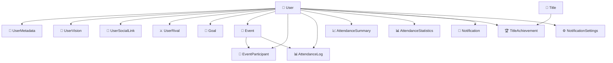

# ⚖️ Entity Business Rules

> **15のエンティティが実装するビジネスルールとその価値**

## 🏗️ エンティティ構成図



---

## 🧑‍💼 User Domain: アイデンティティの保証

### 👤 **User Entity** - 認証基盤の確立

```go
// 必須制約
if clerkID == "" {
    return nil, errors.New("Clerk IDは必須です")
}
if email == "" {
    return nil, errors.New("メールアドレスは必須です")
}
```

**ビジネスルール**:
- **Clerk認証必須**: セキュアな認証基盤
- **メールアドレス必須**: コミュニケーション手段の確保
- **Discord連携**: プラットフォーム統合の準備

**価値**: 信頼できるアイデンティティ管理、外部プラットフォーム連携

---

### 🔗 **UserSocialLink Entity** - 外部連携の品質保証

```go
// URL妥当性チェック
if _, err := url.ParseRequestURI(linkURL); err != nil {
    return nil, errors.New("不正なURL形式です")
}
```

**ビジネスルール**:
- **URL形式検証**: 有効なリンクのみ保存
- **プラットフォーム制限**: 定義済みSNSのみ対応
- **公開設定**: プライバシー制御

**価値**: SNS統合の信頼性、ユーザープライバシー保護

---

### ⚔️ **UserRival Entity** - 健全な競争環境

```go
// 自己参照防止
if userID == rivalUserID {
    return nil, errors.New("自分自身をライバルに設定することはできません")
}
```

**ビジネスルール**:
- **自己ライバル禁止**: システムの論理的整合性
- **最大3人制限**: アプリケーション層で実装予定
- **双方向関係**: 一方的なライバル設定

**価値**: 健全な競争文化、システム整合性の維持

---

## 🎯 Goal Domain: 目標達成の支援

### 🎯 **Goal Entity** - 論理的な目標設定

```go
// 期間の整合性チェック
if endedAt != nil && endedAt.Before(startedAt) {
    return nil, errors.New("終了日は開始日より後に設定してください")
}
```

**ビジネスルール**:
- **タイトル必須**: 明確な目標定義
- **期間の論理性**: 時系列の整合性
- **公開/非公開制御**: プライバシー管理

**価値**: 実現可能な目標設定、個人プライバシーの尊重

---

## 📅 Event Domain: 構造化されたイベント管理

### 📅 **Event Entity** - 時間管理の厳密性

```go
// 時間制約チェック
if !endTime.After(startTime) {
    return nil, errors.New("終了時間は開始時間より後に設定してください")
}

// 定員管理
if maxParticipants != nil && *maxParticipants <= 0 {
    return nil, errors.New("最大参加者数は1以上で指定してください")
}
```

**ビジネスルール**:
- **時間の論理性**: 物理的に可能なスケジュール
- **定員の現実性**: 正の整数による制限
- **イベント分類**: 7種類のカテゴリ統一
- **Discord連携**: チャンネル紐付け

**価値**: 実現可能なイベント、効率的な参加者管理

---

### 👥 **EventParticipant Entity** - 参加状況の透明性

```go
// シンプルな状態管理
status := vo.ParticipantStatusRegistered  // または Cancelled
```

**ビジネスルール**:
- **明確な参加状態**: 登録済み/キャンセルの2状態
- **重複防止**: アプリケーション層で制御
- **キャンセル後再登録**: 柔軟な参加管理

**価値**: 透明な参加状況、ユーザーの利便性

---

## 🏅 Title Domain: ゲーミフィケーションの実現

### 🏅 **Title Entity** - 品質の高い称号定義

```go
// 多言語対応の必須チェック
if nameJP == "" {
    return nil, errors.New("日本語名は必須です")
}
if nameEN == "" {
    return nil, errors.New("英語名は必須です")
}

// 獲得条件の妥当性
if requiredDays < 0 {
    return nil, errors.New("必要日数は0以上で指定してください")
}
```

**ビジネスルール**:
- **バイリンガル必須**: 日英両言語での称号名
- **ストーリー性**: 説明文による価値伝達
- **段階的要求**: レベルに応じた必要日数
- **視覚的表現**: 画像とテーマカラー

**価値**: 国際化対応、魅力的な成長体験

---

### 🏆 **TitleAchievement Entity** - 達成記録の確実性

```go
// 基本的な実績記録
achievedAt := time.Now()  // 獲得タイムスタンプ
isCurrent := vo.CurrentFlagCurrent  // 現在設定フラグ
```

**ビジネスルール**:
- **獲得日時記録**: 達成の証跡保持
- **現在称号管理**: 1つのみ表示可能
- **ユーザー-称号紐付け**: 多対多の関係管理

**価値**: 成果の可視化、モチベーション維持

---

## 📊 Attendance Domain: 客観的な成果測定

### 📊 **AttendanceLog Entity** - 参加の正確な記録

```go
// Discord必須情報
if discordChannelID == "" {
    return nil, errors.New("DiscordチャンネルIDは必須です")
}

// 時間整合性チェック
if leftAt != nil && leftAt.Before(joinedAt) {
    return nil, errors.New("退出時刻は参加時刻より後に設定してください")
}
```

**ビジネスルール**:
- **Discord連携必須**: プラットフォーム統合
- **時間の論理性**: 参加・退出の順序確保
- **有効性判定**: 最低参加時間の概念
- **イベント紐付け**: オプショナルな関連付け

**価値**: 客観的な参加証明、自動化された記録

---

### 📈 **AttendanceSummary Entity** - 日次集計の品質

```go
// 時刻の整合性
if firstJoinTime != nil && lastLeaveTime != nil && lastLeaveTime.Before(*firstJoinTime) {
    return nil, errors.New("最後の退出時刻は最初の参加時刻より後に設定してください")
}
```

**ビジネスルール**:
- **朝活時間検出**: 6-7時の特別扱い
- **集計データ検証**: セッション数と時間の整合性
- **1日1レコード**: 日付単位での集約

**価値**: 効率的なデータ集計、朝活パターンの可視化

---

### 📊 **AttendanceStatistics Entity** - 長期トレンドの管理

```go
// 連続記録の整合性
if currentStreakDays.Value() > maxStreakDays.Value() {
    return nil, errors.New("現在の連続参加日数は最大連続参加日数を超えることはできません")
}

// 日付の論理性
if firstAttendanceDate != nil && lastAttendanceDate != nil && lastAttendanceDate.Before(*firstAttendanceDate) {
    return nil, errors.New("最後の参加日は初回参加日より後に設定してください")
}
```

**ビジネスルール**:
- **連続記録の論理**: 現在 ≤ 最大の関係維持
- **統計データ整合性**: 総参加日数の非負制約
- **期間の妥当性**: 初回 ≤ 最終参加日

**価値**: 正確な進捗トラッキング、称号システムとの連携

---

## 🔔 Notification Domain: 効果的なコミュニケーション

### 🔔 **Notification Entity** - 確実な情報伝達

```go
// 必須コンテンツチェック
if title == "" {
    return nil, errors.New("通知タイトルは必須です")
}
if message == "" {
    return nil, errors.New("通知メッセージは必須です")
}
```

**ビジネスルール**:
- **コンテンツ必須**: タイトルとメッセージの保証
- **構造化データ**: JSON形式での拡張情報
- **配信スケジュール**: 即座配信と予約配信
- **既読管理**: ユーザー体験の向上

**価値**: 確実な情報伝達、パーソナライズされた通知体験

---

### ⚙️ **NotificationSettings Entity** - ユーザー中心の設定

```go
// デフォルト設定の提供
achievementEnabled:   true   // 称号獲得通知
reminderEnabled:      true   // リマインダー通知  
rivalUpdateEnabled:   true   // ライバル更新通知
eventReminderEnabled: true   // イベントリマインダー
reminderTime:         21:00  // 夜9時のリマインダー
```

**ビジネスルール**:
- **デフォルト有効**: オプトアウト方式
- **細分化制御**: 通知種別ごとの個別設定
- **時刻カスタマイズ**: 個人の生活リズムに対応
- **即座反映**: 設定変更の即時適用

**価値**: ユーザー主導の通知管理、押し付けない設計

---

## 🎯 制約による価値創出

### 💎 **品質保証の仕組み**

| エンティティ種別 | 制約の性質 | 保証する品質 |
|-----------------|-----------|------------|
| **User系** | 認証・形式検証 | セキュリティ・連携性 |
| **Goal系** | 時間・論理性 | 実現可能性・整合性 |
| **Event系** | 時間・定員 | 物理的実現性・管理効率 |
| **Title系** | 多言語・段階性 | 国際化・モチベーション |
| **Attendance系** | 時系列・統計 | データ品質・分析精度 |
| **Notification系** | 必須項目・設定 | 確実性・ユーザー体験 |

### 🚀 **ビジネス効果の実現**

1. **データ整合性** → 信頼できる分析・レポート
2. **ユーザビリティ** → 使いやすく継続しやすい体験
3. **拡張性** → 将来機能の安全な追加
4. **保守性** → 低コストでの運用・改善
5. **国際化** → グローバル展開への準備

**これらのビジネスルールにより、朝活コミュニティアプリは「技術的に堅牢で、ユーザー中心の体験」を実現しています。**